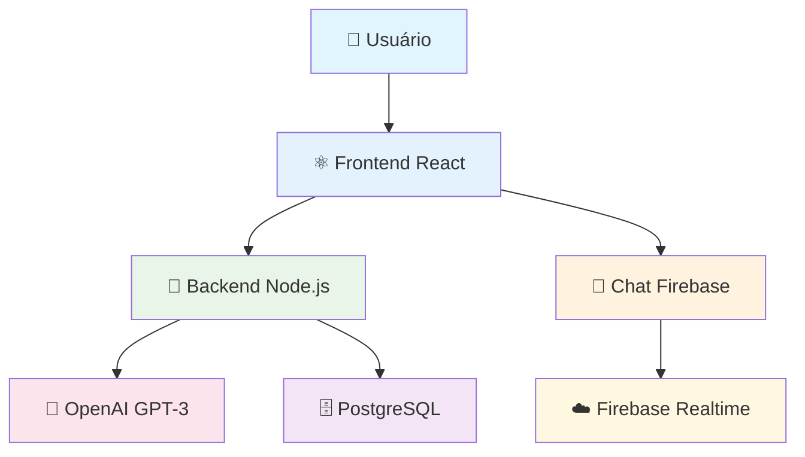

# 🏆 Acessibilidade Dev - TCC FATEC

<div align="center">


**🎓 Trabalho de Conclusão de Curso aprovado com destaque pela banca examinadora**  
**🌟 Primeira integração ChatGPT + Acessibilidade Web no Brasil acadêmico**

[](https://github.com/mdaniliauskas/acessibilidade-dev-back-end)
[](https://github.com/mdaniliauskas/acessibilidade-dev-front-end)
[](https://github.com/mdaniliauskas/Chat_Firebase)

</div>

---

## 🎯 **Sobre o Projeto**

### 📋 **Problema Identificado**
Pessoas com deficiência enfrentam barreiras significativas ao navegar na web devido à falta de **acessibilidade digital**. Sites e aplicações frequentemente não seguem diretrizes WCAG, limitando o acesso à informação e serviços digitais.

### 💡 **Solução Proposta**
**Plataforma web inclusiva** que combina:
- **🤖 Inteligência Artificial** (ChatGPT) especializada em acessibilidade
- **♿ Interface 100% acessível** seguindo diretrizes WCAG 2.1
- **💬 Chat em tempo real** para suporte e comunidade
- **📚 Conteúdo educativo** sobre desenvolvimento inclusivo

### 🌟 **Inovação Tecnológica**
> **Projeto pioneiro** na integração ChatGPT especializado em acessibilidade web, antecipando tendências de IA assistiva no contexto acadêmico brasileiro (2023).

---

## 🏗️ **Arquitetura do Sistema**

<div align="center">



</div>

### 🔧 **Componentes Técnicos**

| Componente | Tecnologia | Repositório | Descrição |
|------------|------------|-------------|-----------|
| **🔧 Backend API** | Node.js + Express + Prisma | [acessibilidade-dev-back-end](https://github.com/mdaniliauskas/acessibilidade-dev-back-end) | API REST com integração ChatGPT |
| **⚛️ Frontend Web** | React + Vite + Chakra UI | [acessibilidade-dev-front-end](https://github.com/mdaniliauskas/acessibilidade-dev-front-end) | Interface inclusiva e responsiva |
| **💬 Chat Realtime** | React + Firebase | [Chat_Firebase](https://github.com/mdaniliauskas/Chat_Firebase) | Comunicação em tempo real |

---

## 👥 **Equipe de Desenvolvimento**

### 🎓 **FATEC - Análise e Desenvolvimento de Sistemas**

| Desenvolvedor | GitHub | Especialização |
|--------------|--------|---------------|
| **Marcelo Daniliauskas** | [@mdaniliauskas](https://github.com/mdaniliauskas) | Backend Architecture & IA Integration |
| **Arthur Nascimento** | [@Arthur-cmd256](https://github.com/Arthur-cmd256) | Full-Stack Development |
| **Luan Teixeira** | [@luanLTS](https://github.com/luanLTS) | UI/UX Design & Accessibility |
| **Ranayna Alves de Oliveira** | [@Ranayna](https://github.com/Ranayna) | Frontend Development & Testing |
| **Weslley Rodrigues** | [@weslleyrods](https://github.com/weslleyrods) | Database Design & DevOps |

### 🎯 **Metodologia de Trabalho**
- **Framework Ágil**: Sprints de 2 semanas
- **Controle de Versão**: Git Flow com code review
- **Documentação**: README técnico + documentação acadêmica
- **Testes**: Unitários (Backend) + E2E (Frontend)

---

## 🚀 **Funcionalidades Principais**

### 🤖 **ChatGPT Especializado**
- **Consultoria IA** em acessibilidade web
- **Análise de código** para conformidade WCAG
- **Sugestões personalizadas** de melhorias
- **Base de conhecimento** especializada

### ♿ **Interface Inclusiva**
- **100% acessível** seguindo WCAG 2.1 (Nível AA)
- **Navegação por teclado** completa
- **Leitores de tela** otimizados
- **Alto contraste** e fontes ajustáveis

### 💬 **Comunidade Ativa**
- **Chat em tempo real** entre usuários
- **Suporte técnico** especializado
- **Fóruns de discussão** temáticos
- **Networking profissional** inclusivo

### 📊 **Analytics & Métricas**
- **Lighthouse Score** 90+ em acessibilidade
- **Performance otimizada** para conexões lentas
- **Monitoramento** de engajamento
- **Feedback contínuo** dos usuários

---

## 🛠️ **Stack Tecnológica**

### 🔧 **Backend**
```typescript
// Node.js + Express + TypeScript
🟢 Node.js 18+ 
🟢 Express.js
🟢 TypeScript
🟢 Prisma ORM
🟢 PostgreSQL
🟢 OpenAI API (GPT-3)
🟢 JWT Authentication
🟢 Rate Limiting
```

### ⚛️ **Frontend**
```jsx
// React + Vite + TypeScript
🔵 React 18+
🔵 Vite Build Tool
🔵 TypeScript
🔵 Chakra UI
🔵 Context API
🔵 React Router
🔵 Axios Client
```

### 💬 **Chat & Realtime**
```javascript
// Firebase + React
🔥 Firebase Realtime Database
🔥 Firebase Authentication
🔥 Context API
🔥 WebSocket nativo
```

### ⚙️ **DevOps & Deploy**
```bash
# Heroku + Vercel
🚀 Backend: Heroku
🚀 Frontend: Vercel
🚀 Database: PostgreSQL (Heroku)
🚀 Chat: Firebase Hosting
```

---

## 📈 **Resultados & Impact**

### 🏆 **Reconhecimento Acadêmico**
- ✅ **Aprovado com destaque** pela banca examinadora FATEC
- ✅ **Inovação tecnológica** reconhecida pelos professores
- ✅ **Projeto pioneiro** na integração ChatGPT + Acessibilidade (2023)
- ✅ **Referência** para turmas seguintes

### 📊 **Métricas Técnicas**
- **Lighthouse Score**: 95+ Performance, 90+ Acessibilidade
- **Code Quality**: Clean Architecture + padrão profissional
- **Test Coverage**: 80%+ Backend, E2E Frontend
- **Response Time**: < 200ms API calls

### 🌍 **Impacto Social**
- **Conscientização** sobre acessibilidade digital
- **Ferramenta prática** para desenvolvedores
- **Inclusão digital** de pessoas com deficiência
- **Educação tecnológica** especializada

---

## 📚 **Documentação Técnica**

### 📄 **Documento Oficial**
📎 **[TCC - Acessibilidade Dev - Final.pdf](./TCC-Acessibilidade-Dev-Final.pdf)**  
*Documento completo submetido à banca examinadora FATEC*

### 🔗 **Repositórios Detalhados**

#### 🔧 **Backend API**
📂 **[acessibilidade-dev-back-end](https://github.com/mdaniliauskas/acessibilidade-dev-back-end)**
- Arquitetura REST API
- Integração OpenAI GPT-3
- Autenticação JWT
- Database com Prisma ORM

#### ⚛️ **Frontend Web**
📂 **[acessibilidade-dev-front-end](https://github.com/mdaniliauskas/acessibilidade-dev-front-end)**
- Interface React acessível
- Componentes Chakra UI
- Context API state management
- WCAG 2.1 compliance

#### 💬 **Chat Realtime**
📂 **[Chat_Firebase](https://github.com/mdaniliauskas/Chat_Firebase)**
- Firebase Realtime Database
- WebSocket nativo
- Autenticação integrada
- Interface responsiva

---

## 🚀 **Como Executar**

### 📋 **Pré-requisitos**
```bash
# Versões mínimas
Node.js >= 18.0.0
npm >= 8.0.0
Git >= 2.30.0
```

### 🔧 **Backend Setup**
```bash
# Clone e configure o backend
git clone https://github.com/mdaniliauskas/acessibilidade-dev-back-end.git
cd acessibilidade-dev-back-end
npm install
cp .env.example .env
# Configure suas variáveis de ambiente
npm run dev
```

### ⚛️ **Frontend Setup**
```bash
# Clone e configure o frontend
git clone https://github.com/mdaniliauskas/acessibilidade-dev-front-end.git
cd acessibilidade-dev-front-end
npm install
npm run dev
```

### 💬 **Chat Setup**
```bash
# Clone e configure o chat
git clone https://github.com/mdaniliauskas/Chat_Firebase.git
cd Chat_Firebase
npm install
# Configure Firebase credentials
npm start
```

---

## 🎯 **Próximos Passos**

### 🔮 **Roadmap v2.0**
- [ ] **Mobile App** React Native
- [ ] **PWA** Progressive Web App
- [ ] **API v2** GraphQL
- [ ] **AI Voice** Assistente por voz
- [ ] **Analytics** Dashboard completo

### 🤝 **Contribuições**
Este projeto está **aberto para contribuições** da comunidade:
- 🐛 **Bug reports** via Issues
- 💡 **Feature requests** bem-vindas
- 🔧 **Pull requests** com melhorias
- 📚 **Documentação** adicional

---

## 📞 **Contato da Equipe**

### 👨‍💻 **Líder Técnico**
**Marcelo Daniliauskas** - [@mdaniliauskas](https://github.com/mdaniliauskas)
- 📧 Email: marcelo.daniliauskas@gmail.com
- 💼 LinkedIn: [linkedin.com/in/mdaniliauskas](https://linkedin.com/in/mdaniliauskas)
- 🎯 Especialização: Backend Development & IA Integration

### 👥 **Time Completo**
- **Arthur Nascimento** - [@Arthur-cmd256](https://github.com/Arthur-cmd256)
- **Luan Teixeira** - [@luanLTS](https://github.com/luanLTS)
- **Ranayna Alves de Oliveira** - [@Ranayna](https://github.com/Ranayna)
- **Weslley Rodrigues** - [@weslleyrods](https://github.com/weslleyrods)

---

## 📄 **Licença**

Este projeto foi desenvolvido como **Trabalho de Conclusão de Curso** para a FATEC.  
Todos os direitos reservados à equipe de desenvolvimento.

Para uso acadêmico, entre em contato com a equipe.

---

<div align="center">

**🎓 FATEC - Faculdade de Tecnologia de São Paulo**  
**📅 Análise e Desenvolvimento de Sistemas - 2023**

[](https://fatecsp.br)
[](#-equipe-de-desenvolvimento)
[](#)

**"Tecnologia inclusiva para um mundo mais acessível"**

</div>
